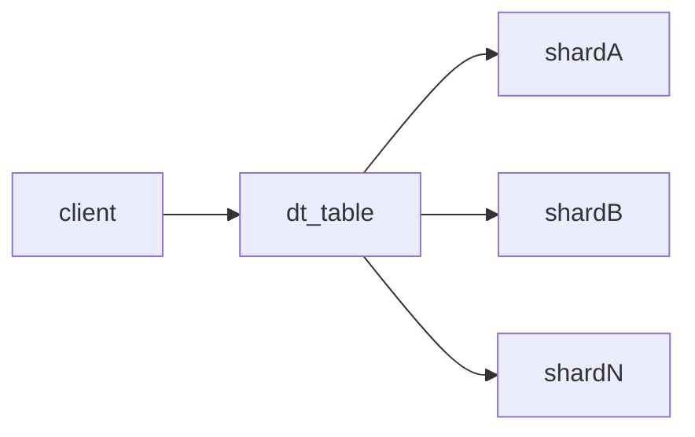
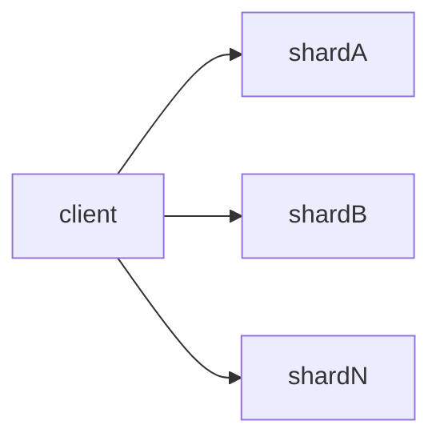

# Clickhouse是什么？
Clickhouse是一个面向列的数据库管理系统(DBMS)，用于在线查询分析处理(OLAP),它支持多种database engine和table engine，我们可以在不同的业务场景下选择合适的table engine。

# 分布式表引擎
表引擎众多，可能你不会用到所有的类型，但有一种引擎是迟早会用到的，它就是分布式引擎，因为它是当table中数据达到一定量级时，进行水平扩展的主要方式。

*分布式引擎本身不存储数据*, 但可以在cluster中的多个服务器上进行分布式查询。cluster通过配置文件来定义
```xml
<remote_servers>
    <my_cluster>
        <!-- <secret></secret> -->
        <shard>
            <!-- 可选的。写数据时分片权重。 默认: 1. -->
            <weight>1</weight>
            <!-- 可选的。是否只将数据写入其中一个副本。默认值:false(将数据写入所有副本),设置为ture时，只会写入shard中的单个节点，其它节点通过*ReplicaMergeTree表内部实现复制 -->
            <internal_replication>false</internal_replication>
            <replica>
                <!-- 可选的。负载均衡副本的优先级。默认值:1(值越小优先级越高)。 -->
                <priority>1</priority>
                <host>example01-01-1</host>
                <port>9000</port>
            </replica>
        </shard>
        <shard>
            <weight>2</weight>
            <internal_replication>false</internal_replication>
            <replica>
                <host>example01-02-1</host>
                <port>9000</port>
            </replica>
            <replica>
                <host>example01-02-2</host>
                <secure>1</secure>
                <port>9440</port>
            </replica>
        </shard>
    </my_cluster>
</remote_servers>
```
在所有cluster中的所有CH上创建数据表
```sql
CREATE TABLE users
(
    user_id UInt64,
    age Int32,
    name String
) ENGINE = MergeTree()
PARTITION BY (user_id)
ORDER BY (age)

```
在程序需要直连的CH上创建分布式表,其中`user_id`为我们指定的`sharding_key`
```sql
CREATE TABLE users_all AS users
ENGINE = Distributed(my_cluster, default, users, user_id)
SETTINGS
    fsync_after_insert=0,
    fsync_directories=0;
```
## 读取操作
将查询请求转发到多个远端服务器进行并行查询，然后返回合并后的查询结果。

## 写入操作
- 直接将请求发送到存储数据的db

- 将请求发送到分布式表，再由分布式表所在服务器将请求分配到不同的数据存储服务器,此种模式需要在创建表时包含`sharding_key`参数

